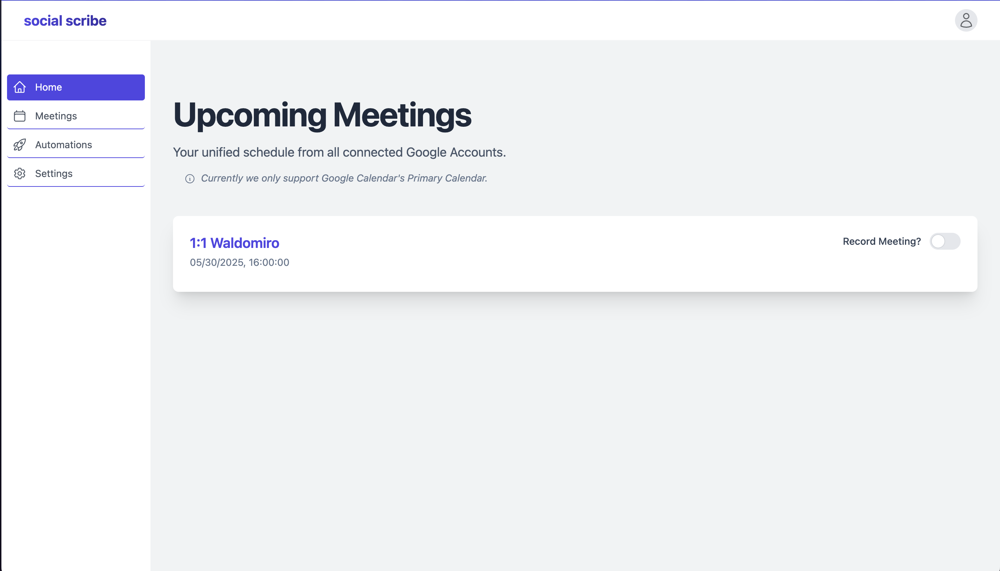
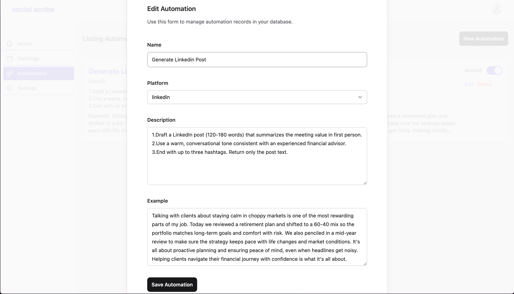

# Social Scribe 🤖📝✨

**Stop manually summarizing meetings and drafting social media posts! Social Scribe leverages AI to transform your meeting transcripts into engaging follow-up emails and platform-specific social media content, ready to share.**

Social Scribe is a powerful Elixir and Phoenix LiveView application designed to connect to your calendars, automatically send an AI notetaker to your virtual meetings, provide accurate transcriptions via Recall.ai, and then utilize Google Gemini's advanced AI to draft compelling follow-up emails and social media posts through user-defined automation rules. This project was developed with significant AI assistance, as encouraged by the challenge, to rapidly build a feature-rich application.

---

## 🌟 Key Features Implemented

* **Google Calendar Integration:**
    * Seamlessly log in with your Google Account.
    * Connect multiple Google accounts to aggregate events from all your calendars.
    * View your upcoming calendar events directly within the app's dashboard.
* **Automated Meeting Transcription with Recall.ai:**
    * Toggle a switch for any calendar event to have an AI notetaker attend.
    * The app intelligently parses event details (description, location) to find Zoom or Google Meet links.
    * Recall.ai bot joins meetings a configurable number of minutes before the start time (currently default, setting to be added to UI).
    * **Bot ID Management:** Adheres to challenge constraints by tracking individually created `bot_id`s and not using the general `/bots` endpoint.
    * **Polling for Media:** Implements a robust polling mechanism (via Oban) to check bot status and retrieve transcripts/media, as webhooks cannot be used with the shared API key.
* **AI-Powered Content Generation (Google Gemini):**
    * Automatically drafts a follow-up email summarizing key discussion points and action items from the meeting transcript.
    * **Custom Automations:** Users can create, view, and manage automation templates, defining custom prompts, target platforms (LinkedIn, Facebook), and descriptions to generate specific marketing content or other post types.
* **Social Media Integration & Posting:**
    * Securely connect LinkedIn and Facebook accounts via OAuth on the Settings page.
    * **Direct Posting:** Generated content can be posted directly to the user's connected LinkedIn profile or a user-managed Facebook Page.
* **Meeting Management & Review:**
    * View a list of past processed meetings, showing attendees, start time, and platform logo (platform logo to be enhanced).
    * Click into any past meeting to view its full transcript, the AI-generated follow-up email draft, and a list of social media posts generated by configured automations.
    * **Copy & Post Buttons:** Social media drafts are presented with a "Copy" button (implemented via JS Hooks) for easy content reuse and direct "Post" buttons for integrated platforms.
* **Modern Tech Stack & Background Processing:**
    * Built with Elixir & Phoenix LiveView for a real-time, interactive experience.
    * Utilizes Oban for robust background job processing (calendar syncing, bot status polling, AI content generation).
    * Secure credential management for all connected services using Ueberauth.

---

## App Flow

* **Login With Google and Meetins Sync:**
    

* **Creating Automations:**
    

* **Meetings Recordings:**
    

* **Facebook Login:**
    

* **Facebook Post:**
    

* **LinkedIn Login & Post:**
    
---

## 📸 Screenshots & GIFs


* **Dashboard View:**
    


* **Automation Configuration UI:**
    

---

## 🛠 Tech Stack

* **Backend:** Elixir, Phoenix LiveView
* **Database:** PostgreSQL
* **Background Jobs:** Oban
* **Authentication:** Ueberauth (for Google, LinkedIn, Facebook, HubSpot OAuth)
* **Meeting Transcription:** Recall.ai API
* **AI Content Generation:** Google Gemini API (Flash models)
* **Frontend:** Tailwind CSS, Heroicons (via `tailwind.config.js`)
* **Progress Bar:** Topbar.js for page loading indication.

---

## 🚀 Getting Started

Follow these steps to get SocialScribe running on your local machine.

### Prerequisites

* Elixir
* Erlang/OTP 
* PostgreSQL
* Node.js (for Tailwind CSS asset compilation)

### Setup Instructions

1.  **Clone the Repository:**
    ```bash
    git clone https://github.com/fparadas/social_scribe.git 
    cd social_scribe
    ```

2.  **Install Dependencies & Setup Database:**
    The `mix setup` command bundles common setup tasks.
    ```bash
    mix setup
    ```
    This will typically:
    * Install Elixir dependencies (`mix deps.get`)
    * Create your database if it doesn't exist (`mix ecto.create`)
    * Run database migrations (`mix ecto.migrate`)
    * Install Node.js dependencies for assets (`cd assets && npm install && cd ..`)

3.  **Configure Environment Variables:**
    You'll need to set up several API keys and OAuth credentials.
    * Copy the example environment file (if one is provided, e.g., `.env.example`) to `.env`.
    * Edit the `.env` file (or set environment variables directly) with your actual credentials:
        * `GOOGLE_CLIENT_ID`: Your Google OAuth Client ID.
        * `GOOGLE_CLIENT_SECRET`: Your Google OAuth Client Secret.
        * `GOOGLE_REDIRECT_URI`: `"http://localhost:4000/auth/google/callback"`
        * `RECALL_API_KEY`: Your Recall.ai API Key (as provided for the challenge).
        * `GEMINI_API_KEY`: Your Google Gemini API Key.
        * `LINKEDIN_CLIENT_ID`: Your LinkedIn App Client ID.
        * `LINKEDIN_CLIENT_SECRET`: Your LinkedIn App Client Secret.
        * `LINKEDIN_REDIRECT_URI`: `"http://localhost:4000/auth/linkedin/callback"`
        * `FACEBOOK_APP_ID`: Your Facebook App ID.
        * `FACEBOOK_APP_SECRET`: Your Facebook App Secret.
        * `FACEBOOK_REDIRECT_URI`: `"http://localhost:4000/auth/facebook/callback"`
        * `HUBSPOT_CLIENT_ID`: Your HubSpot App Client ID.
        * `HUBSPOT_CLIENT_SECRET`: Your HubSpot App Client Secret.
        * `HUBSPOT_REDIRECT_URI`: `"http://localhost:4000/auth/hubspot/callback"`

4.  **Start the Phoenix Server:**
    ```bash
    mix phx.server
    ```
    Or, to run inside IEx (Interactive Elixir):
    ```bash
    iex -S mix phx.server
    ```

Now you can visit [`localhost:4000`](http://localhost:4000) from your browser.

---

## ⚙️ Functionality Deep Dive

* **Connect & Sync:** Users log in with Google. The "Settings" page allows connecting multiple Google accounts, plus LinkedIn and Facebook accounts. For Facebook, after initial connection, users are guided to select a Page for posting. Calendars are synced to a database to populate the dashboard with upcoming events.
* **Record & Transcribe:** On the dashboard, users toggle "Record Meeting?" for desired events. The system extracts meeting links (Zoom, Meet) and uses Recall.ai to dispatch a bot. A background poller (`BotStatusPoller`) checks for completed recordings and transcripts, saving the data to local `Meeting`, `MeetingTranscript`, and `MeetingParticipant` tables.
* **AI Content Generation:**
    * Once a meeting is processed, an `AIContentGenerationWorker` is enqueued.
    * This worker uses Google Gemini to draft a follow-up email.
    * It also processes all active "Automations" defined by the user. For each automation, it combines the meeting data with the user's `prompt_template` and calls Gemini to generate content (e.g., a LinkedIn post), saving it as an `AutomationResult`.
* **Social Posting:**
    * From the "Meeting Details" page, users can view AI-generated email drafts and posts from their automations.
    * "Copy" buttons are available.
    * "Post" buttons allow direct posting to LinkedIn (as the user) and the selected Facebook Page (as the Page).

---

## 🔗 HubSpot Integration

### HubSpot OAuth Integration

* **Custom Ueberauth Strategy:** Implemented in `lib/ueberauth/strategy/hubspot.ex`
* **OAuth 2.0 Flow:** Handles authorization code flow with HubSpot's `/oauth/authorize` and `/oauth/v1/token` endpoints
* **Credential Storage:** Credentials stored in `user_credentials` table with `provider: "hubspot"`, including `token`, `refresh_token`, and `expires_at`
* **Token Refresh:**
    * `HubspotTokenRefresher` Oban cron worker runs every 5 minutes to proactively refresh tokens expiring within 10 minutes
    * Internal `with_token_refresh/2` wrapper automatically refreshes expired tokens on API calls and retries the request
    * Refresh failures are logged; users are prompted to re-authenticate if refresh token is invalid

### HubSpot Modal UI

* **LiveView Component:** Located at `lib/social_scribe_web/live/meeting_live/hubspot_modal_component.ex`
* **Contact Search:** Debounced input triggers HubSpot API search, results displayed in dropdown
* **AI Suggestions:** Fetched via `HubspotSuggestions.generate_suggestions` which calls Gemini with transcript context
* **Suggestion Cards:** Each card displays:
    * Field label
    * Current value (strikethrough)
    * Arrow
    * Suggested value
    * Timestamp link
* **Selective Updates:** Checkbox per field allows selective updates; "Update HubSpot" button disabled until at least one field selected
* **Form Submission:** Batch-updates selected contact properties via `HubspotApi.update_contact`
* **Click-away Handler:** Closes dropdown without clearing selection

---

## ⚠️ Known Issues & Limitations

* **Facebook Posting & App Review:**
    * Posting to Facebook is implemented via the Graph API to a user-managed Page.
    * Full functionality for all users (especially those not app administrators/developers/testers) typically requires a thorough app review process by Meta, potentially including Business Verification. This is standard for apps using Page APIs.
    * During development, posting will be most reliable for app admins to Pages they directly manage.
* **Error Handling & UI Polish:** While core paths are robustly handled, comprehensive error feedback for all API edge cases and advanced UI polish are areas for continued development beyond the initial 48-hour scope.
* **Prompt Templating for Automations:** The current automation prompt templating is basic (string replacement). A more sophisticated templating engine (e.g., EEx or a dedicated library) would be a future improvement.
* **Agenda Integration:** Currently we only sync when the calendar event has a `hangoutLink` or `location` field with a zoom or google meet link.
---

## 📚 Learn More (Phoenix Framework)

* Official website: https://www.phoenixframework.org/
* Guides: https://hexdocs.pm/phoenix/overview.html
* Docs: https://hexdocs.pm/phoenix
* Forum: https://elixirforum.com/c/phoenix-forum
* Source: https://github.com/phoenixframework/phoenix