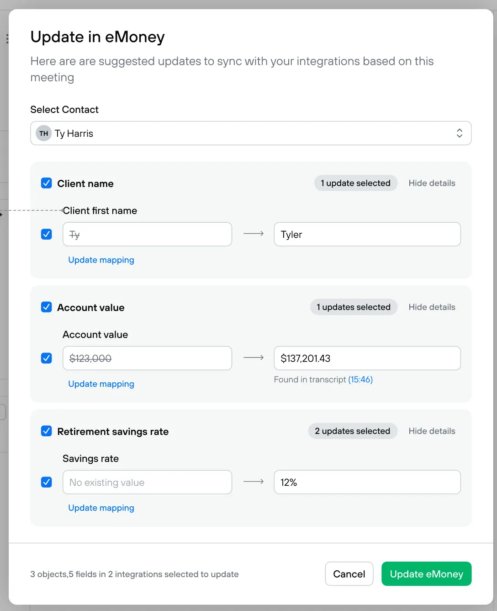

### New feature to add

- In settings, allow me to connect Hubspot using OAuth
    - Create a Hubspot OAuth app. They have a self serve developer portal.
- After you record a new meeting:
    - Allow me to open a modal where I can review suggested updates to a Hubspot contact
    - Show a search/select where I can search for a Hubspot contact
    - Use the Hubspot API to pull the contact record
    - Use AI to generate a list of suggested updates to the Hubspot record
        - For example, if the user mentioned “My phone number is 8885550000 it suggests updating their phone number in the CRM”
    - I should show the existing value in Hubspot and the AI suggested update to the field
    - The UI should for reviewing and submitting updates should look exactly like this. We’d like to see your ability to match a design perfectly. 
    - After reviewing the updates, I can click “Update Hubspot” and it will sync the updates to the selected Hubspot contact.